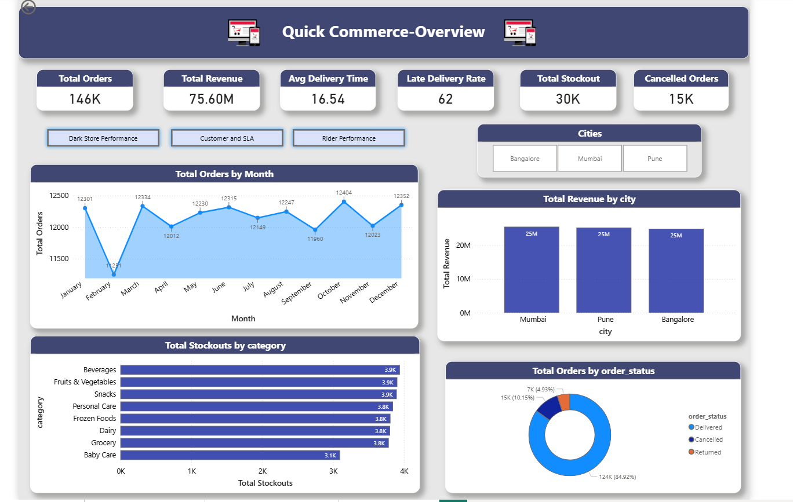
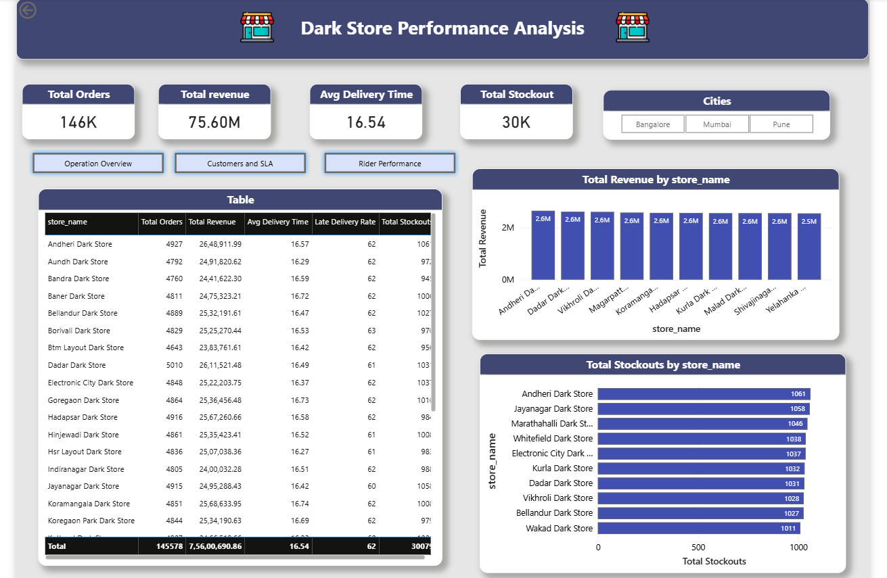
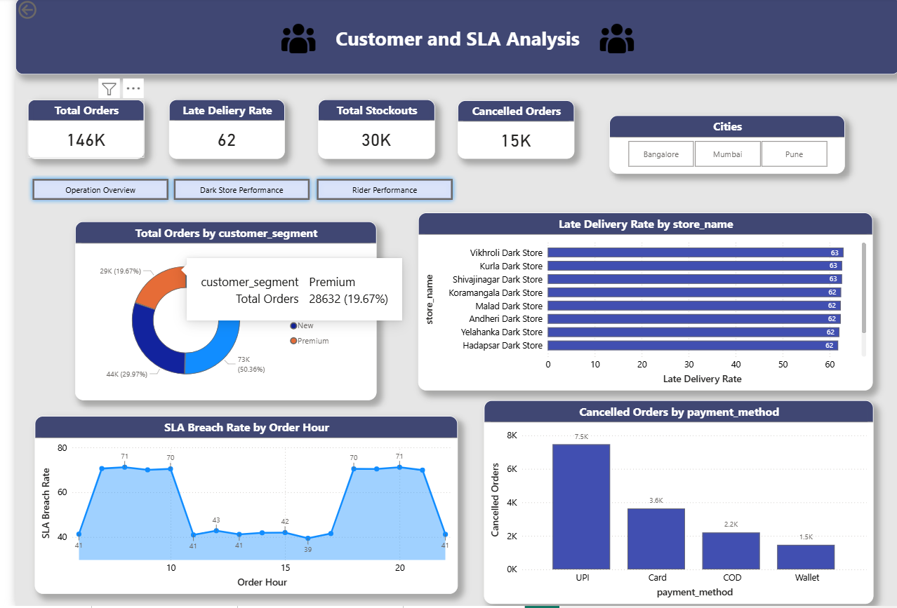
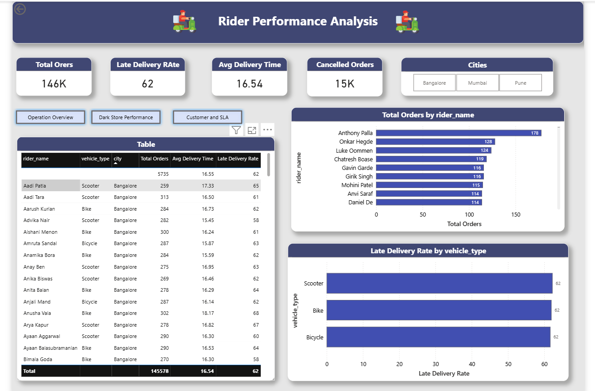

<div align="center">

```
╔═══════════════════════════════════════════════════════════════╗
║                                                               ║
║        ⚡ QUICKCOMMERCE ANALYTICS ENGINE ⚡                   ║
║        Instant-Delivery Intelligence Platform                 ║
║                                                               ║
╚═══════════════════════════════════════════════════════════════╝
```


*An enterprise-grade, end-to-end analytics platform simulating hyper-local instant-delivery operations — modeled after systems like Zepto, Blinkit, and Swiggy Instamart.*

</div>

---

## 📌 The Business Problem

Quick-commerce companies promise **10-minute delivery**. But what actually happens at scale?

- Which dark stores are hemorrhaging revenue due to stockouts at 8am?
- At what exact order volume does your SLA promise collapse?
- Which riders are dragging your average delivery time up — and why?

This project answers those questions with a **production-grade data pipeline** processing **145,000+ real transactions** across 3 cities, 30 dark stores, 500 riders, and 5,000 customers.

---

## 🏗️ Architecture Overview

```
┌─────────────────────────────────────────────────────────────────┐
│                     DATA FLOW ARCHITECTURE                       │
├─────────────────────────────────────────────────────────────────┤
│                                                                   │
│   RAW CSVs (150K rows)                                           │
│        │                                                          │
│        ▼                                                          │
│   ┌─────────────┐    ┌─────────────┐    ┌─────────────┐         │
│   │   BRONZE    │───▶│   SILVER    │───▶│    GOLD     │         │
│   │  Raw Delta  │    │  Cleaned &  │    │  Business   │         │
│   │  Ingestion  │    │  Deduped    │    │Aggregations │         │
│   └─────────────┘    └─────────────┘    └─────────────┘         │
│         Databricks + PySpark + Delta Lake                        │
│                            │                                      │
│                            ▼                                      │
│                   ┌─────────────────┐                            │
│                   │  MySQL 8.0      │                            │
│                   │  Star Schema    │                            │
│                   │  Data Warehouse │                            │
│                   └────────┬────────┘                            │
│                            │                                      │
│                   ┌────────▼────────┐                            │
│                   │  Power BI       │                            │
│                   │  Executive      │                            │
│                   │  Dashboard      │                            │
│                   └─────────────────┘                            │
└─────────────────────────────────────────────────────────────────┘
```

---

## 🗂️ Project Structure

```
QuickCommerce-Analytics/
│
├── 📂 data/
│   ├── raw/                    ← 5 CSVs generated by Python (gitignored)
│   └── processed/              ← Cleaned Gold exports from Databricks (gitignored)
│
├── 📂 notebooks/
│   └── 01_data_generation.ipynb   ← 150K+ row synthetic data generation
│
├── 📂 databricks/
│   ├── 01_bronze_layer.py         ← Raw Delta ingestion
│   ├── 02_silver_layer.py         ← Cleaning, deduplication, type casting
│   └── 03_gold_layer.py           ← Business aggregations
│
├── 📂 sql/
│   └── analysis_queries.sql       ← 3 advanced SQL analytical queries
│
├── 📂 powerbi/
│   └── QuickCommerce_Dashboard.pbix  ← 4-page executive dashboard
│
└── 📂 scripts/                    ← Utility scripts
```

---

## ⚙️ Phase 1 — Big Data Pipeline (Databricks + PySpark)

### Medallion Architecture

| Layer | Description | Tables | Records |
|-------|-------------|--------|---------|
| 🥉 **Bronze** | Raw CSV ingestion, no transformations | 5 Delta tables | 150,000 |
| 🥈 **Silver** | Deduplicated, cleaned, type-cast | 5 Delta tables | 145,578 |
| 🥇 **Gold** | Business-ready aggregations | 4 Delta tables | 16,510 |

### Anomalies Injected & Cleaned

| Anomaly | Injected | Cleaned In |
|---------|----------|------------|
| Duplicate order IDs (~3%) | Bronze | Silver |
| Missing rider IDs (~4%) | Bronze | Silver → `UNASSIGNED` |
| Invalid delivery times (-5, 99, 120 mins) | Bronze | Silver → Median imputation |
| Peak-hour stockout clustering | Bronze | Preserved for analysis |

### Star Schema Design

```
                    ┌──────────────────┐
                    │  dim_customers   │
                    │  (5,000 rows)    │
                    └────────┬─────────┘
                             │
┌──────────────┐    ┌────────▼─────────┐    ┌──────────────────┐
│ dim_products │    │   fact_orders    │    │  dim_dark_stores │
│  (39 rows)   │◀───│  (145,578 rows)  │───▶│   (30 rows)      │
└──────────────┘    └────────┬─────────┘    └──────────────────┘
                             │
                    ┌────────▼─────────┐
                    │   dim_riders     │
                    │  (500 rows)      │
                    └──────────────────┘
```

---

## 🔍 Phase 2 — Advanced SQL Analytics (MySQL 8.0)

Three production-grade analytical queries using **CTEs**, **Window Functions**, and **DENSE_RANK()**.

---

### Query 1 — Stockout & Fill Rate Analysis

**Business Question:** *Which dark stores are losing the most revenue due to stockouts during peak hours?*

**Key Finding:**
```
🔴 Dadar Dark Store loses ₹2,59,241 in revenue during morning peak alone
🔴 Stockout rate jumps from 11% → 26% during peak hours
🔴 Mumbai and Bangalore stores dominate the top revenue-loss positions
```

**Techniques Used:** CTEs, CASE WHEN peak-hour segmentation, DENSE_RANK() OVER PARTITION BY hour_type

---

### Query 2 — Rider Efficiency Analysis

**Business Question:** *Who are the best and worst performing riders and how do they rank within their city?*

**Key Finding:**
```
🏆 Best Rider  — Ekanta Mandal (Pune, Scooter) — 54.23% late delivery rate
💀 Worst Rider — Harshil Buch (Pune, Bike)     — 71.38% late delivery rate
📊 Bicycles appear disproportionately in worst performers
```

**Techniques Used:** CTEs, AVG with CASE WHEN, DENSE_RANK() OVER PARTITION BY city (both ASC and DESC)

---

### Query 3 — SLA Breach Tipping Points

**Business Question:** *At what exact hour does the 10-minute delivery promise start breaking?*

**Key Finding:**
```
⚡ Hour 6  → 41.57% SLA breach (normal)
⚡ Hour 7  → 70.58% SLA breach (+29% spike in ONE hour) ← TIPPING POINT
⚡ Hour 18 → 70.48% SLA breach (+29% spike again)      ← TIPPING POINT
⚡ Normal hours consistently hold ~41% breach rate
```

**Techniques Used:** CTEs, LAG() window function to calculate hour-over-hour breach change, CASE WHEN peak classification

---

## 📊 Phase 3 — Executive Power BI Dashboard

4-page interactive dashboard with **7 DAX measures**, **cross-page slicers**, and **page navigation**.

| Page | Focus | Key Visuals |
|------|-------|-------------|
| **Operations Overview** | Platform-wide KPIs | 6 KPI cards, Monthly trend, Revenue by city, Stockouts by category |
| **Dark Store Performance** | Store-level efficiency | Store performance table, Top 10 by revenue, Top 10 by stockouts |
| **Customer & SLA Analysis** | SLA breach patterns | SLA breach by hour, Customer segment breakdown, Cancellations by payment |
| **Rider Performance** | Rider efficiency | Top 10 riders, Late rate by vehicle type, Full rider performance table |

### Dashboard Screenshots

**Page 1 — Operations Overview**


**Page 2 — Dark Store Performance**


**Page 3 — Customer & SLA Analysis**


**Page 4 — Rider Performance**


### DAX Measures Built

```dax
Total Orders       = COUNTROWS('fact_orders')
Total Revenue      = SUM('fact_orders'[total_amount])
Avg Delivery Time  = AVERAGE('fact_orders'[actual_delivery_mins])
Late Delivery Rate = DIVIDE(SUM(is_late_delivery), COUNTROWS(...)) * 100
SLA Breach Rate    = DIVIDE(CALCULATE(COUNTROWS(...), delivery > 10), ...) * 100
Total Stockouts    = SUM('fact_orders'[is_stockout])
Cancelled Orders   = CALCULATE(COUNTROWS(...), order_status = "Cancelled")
```

---

## 📈 Key Business Insights

| # | Insight | Impact |
|---|---------|--------|
| 1 | SLA breach spikes **+29% in a single hour** at peak start (7am & 6pm) | Staffing model needs peak-hour surge planning |
| 2 | **62% of all deliveries are late** against 10-min SLA | SLA promise needs re-evaluation or ops overhaul |
| 3 | Top 5 stores lose **₹12L+ combined** in morning peak stockouts | Inventory replenishment must happen before 7am |
| 4 | **84.92% of orders are delivered**, 10.15% cancelled | Cancellation rate is a key churn driver |
| 5 | Rider late delivery rate ranges from **54% to 71%** within same city | Training and route optimization needed |

---

## 🛠️ Tech Stack

| Tool | Purpose | Version |
|------|---------|---------|
| Python | Data generation | 3.11 |
| Pandas / NumPy | Data manipulation | Latest |
| Faker | Synthetic data | Latest |
| Databricks | Cloud compute | Community Edition |
| PySpark | Distributed processing | 3.x |
| Delta Lake | ACID storage format | Latest |
| MySQL | Data warehouse | 8.0 |
| Power BI Desktop | Dashboard | Latest |
| DAX | BI calculations | — |

---

## 🚀 How to Run This Project

### Prerequisites
- Python 3.11+
- MySQL 8.0
- Databricks Community Edition account
- Power BI Desktop

### Step 1 — Clone & Setup
```bash
git clone https://github.com/h4rshalk/QuickCommerce-Analytics.git
cd QuickCommerce-Analytics
python -m venv venv
venv\Scripts\activate
pip install pandas numpy faker jupyter ipykernel
```

### Step 2 — Generate Data
```bash
jupyter notebook
# Open notebooks/01_data_generation.ipynb
# Run all cells → generates 5 CSVs in data/raw/
```

### Step 3 — Run Databricks Pipeline
```
Upload CSVs to Databricks Volume
Run 01_bronze_layer notebook
Run 02_silver_layer notebook
Run 03_gold_layer notebook
Download exports to data/processed/
```

### Step 4 — Load MySQL
```sql
CREATE DATABASE quickcommerce;
-- Run schema creation and LOAD DATA INFILE for all 9 tables
-- Full queries in sql/analysis_queries.sql
```

### Step 5 — Open Dashboard
```
Open powerbi/QuickCommerce_Dashboard.pbix in Power BI Desktop
Connect to localhost/quickcommerce with your MySQL credentials
Refresh data
```

---

## 👨‍💻 Author

**Harshal Kawane** — Data Analyst

[](https://www.linkedin.com/in/harshal-kawane/)
[](https://github.com/h4rshalk)
[](https://www.kaggle.com/h4rshal3)

---

<div align="center">

*Built with the goal of proving that great data analysts don't just build charts — they engineer insight.*

</div>
